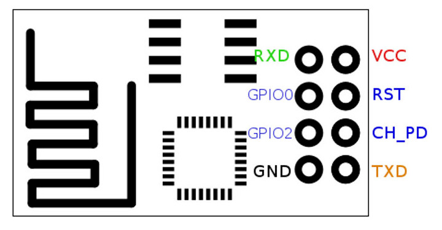
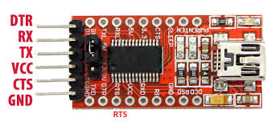
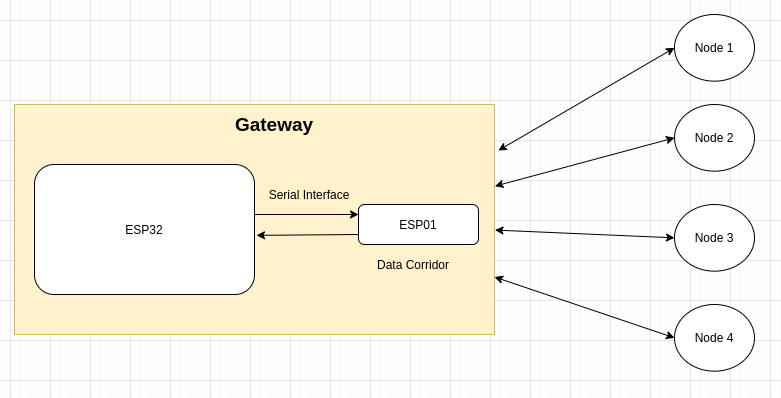

# Data Corridor
This repo contains the firmware for gateway node. Data corridor is reponsible for forwarding messages from gateway to individual nodes.

There are two firmwares that you need to flash into your devices to make the gateway work properly.
  1. Gateway Node Firmware 
  2. Data Corridor Firmware (this)

## Getting Started

### Setup
  - Clone the project
  - Open the project in VS Code (with Platform IO extension installed)
  - To run the projcet select `esp01_1m` environment
  - Some other steps go here
  - Build and upload the code to ESP01s device

### Hardware Connection

  1. Connect ESP32's `TX2` to `RX` pin of ESP01.
  2. Connect ESP32's `RX2` to `TX` pin of ESP01.
  3. Connect ESP32's `3v3` pin to `3v3` pin of ESP01.
  4. Connect ESP32's `GND` pin to `GND` pin of ESP01.
  5. Connect ESP01's `CH_PD` to `3V3` to enable the chip. Otherwise the chip won't start.

### Setup Debug Serial
If you wish to see the debug messages from data corridor. Connect an FTDI adapter to it. Pins connections:
  1. Connect `Tx` from FTDI to `GPIO 0` of ESP01s
  2. Connect `Rx` from FTDI to `GPIO 2` of ESP01s
  3. Connect `GND` from FTDI to `GND` on ESP32/ESP01s board

## Working
Hardware serial interface is used to communicate with ESP32.
Another software serial interface is created on pins 0 and 2 for putting out debug information.
Gateway forwards every command to ESP01 through UART and then ESP01 is responsible for sending that command to its respective nodes.

